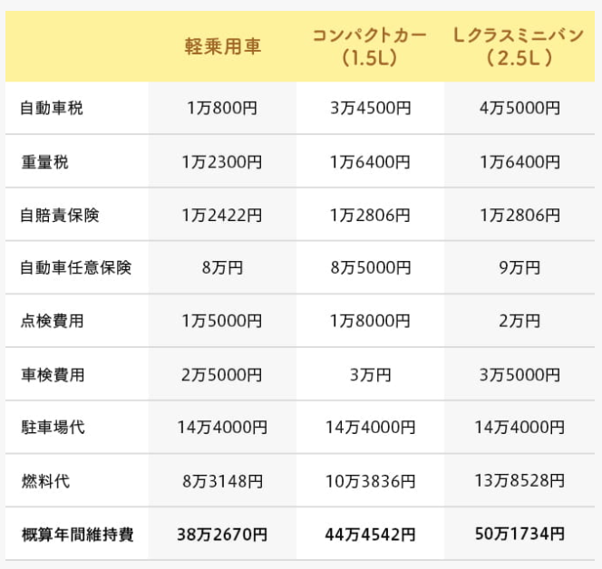

在國內的時候買了一台車，那個時候的經驗，因為很久以前不是很記得，好像就去4S,說要買車，然後交錢，然後就等著提車了。

在日本因為疫情的關係，出門坐電車顧慮多，打算買2手的，國內經驗無法借鑒，只能自己網上學習。

首先是費用估算。

# 經費

- 駐車場代（賃借の場合、毎月）
- 重量税（車検ごと）
- 車検費用（隔年、新車時のみ3年。法定費用＋整備費）
- 車両購入費用
- 自賠責保険（概ね車検ごと）
- 自動車税（年1回）
- 自動車任意保険（契約により月払い、年払いなど）
- 燃料代（ガソリン、軽油）
- 点検費用（法定点検年1回、法定費用＋整備費）
- ローン金利（ローン購入の場合）
- その他整備費、消耗品費用（タイヤなど）



根據實際操作經驗，經過調整一年大概可以壓縮到30萬日元以下。

經過考慮後，大概猶豫了一周吧。判斷出這個花費應該會小於回報的價值，因此計劃購入。

# 車庫證明

正式的法律名詞是
```
保管場所証明
```
必須要下載下面的文檔填寫，當然很方便的是有提供電子檔案，可以填寫後打印出來。
或許可以發現在日本買一台打印機很重要。

[保管場所証明申請手続　警視庁](https://www.keishicho.metro.tokyo.jp/smph/tetsuzuki/kotsu/hokan/syako_tetsuzuki/jidousha_syomei.html)

# 車檢證明


# 整備場
車買來後的保養也是。在這裡就要去整備場了。

# 洗車
洗車也是。
車上用品。


<table border="0" cellpadding="0" cellspacing="0"><tr><td><div style="border:1px solid #95a5a6;border-radius:.75rem;background-color:#FFFFFF;width:504px;margin:0px;padding:5px;text-align:center;overflow:hidden;"><table><tr><td style="width:240px"><a href="https://hb.afl.rakuten.co.jp/ichiba/1cd88048.d45b9408.1cd88049.14d32925/?pc=https%3A%2F%2Fitem.rakuten.co.jp%2Fsunflower8%2F9102-1650%2F&link_type=picttext&ut=eyJwYWdlIjoiaXRlbSIsInR5cGUiOiJwaWN0dGV4dCIsInNpemUiOiIyNDB4MjQwIiwibmFtIjoxLCJuYW1wIjoicmlnaHQiLCJjb20iOjEsImNvbXAiOiJkb3duIiwicHJpY2UiOjEsImJvciI6MSwiY29sIjoxLCJiYnRuIjoxLCJwcm9kIjowfQ%3D%3D" target="_blank" rel="nofollow sponsored noopener" style="word-wrap:break-word;"  ></a></td><td style="vertical-align:top;width:248px;"><p style="font-size:12px;line-height:1.4em;text-align:left;margin:0px;padding:2px 6px;word-wrap:break-word"><a href="https://hb.afl.rakuten.co.jp/ichiba/1cd88048.d45b9408.1cd88049.14d32925/?pc=https%3A%2F%2Fitem.rakuten.co.jp%2Fsunflower8%2F9102-1650%2F&link_type=picttext&ut=eyJwYWdlIjoiaXRlbSIsInR5cGUiOiJwaWN0dGV4dCIsInNpemUiOiIyNDB4MjQwIiwibmFtIjoxLCJuYW1wIjoicmlnaHQiLCJjb20iOjEsImNvbXAiOiJkb3duIiwicHJpY2UiOjEsImJvciI6MSwiY29sIjoxLCJiYnRuIjoxLCJwcm9kIjowfQ%3D%3D" target="_blank" rel="nofollow sponsored noopener" style="word-wrap:break-word;"  >8/30 19時〜新色ダークブラウン発売！クーポン利用で50％OFF 大人気インフルエンサーAYAさんコラボ 楽天総合1位 2way シャツワンピ 綿100％ シャツワンピ 羽織り ロング丈シャツ シャツワンピース ロング丈 マキシ丈 シャツ コットンワンピ 体型カバー</a><br><span >価格：3850円（税込、送料無料)</span> <span style="color:#BBB">(2020/9/2時点)</span></p><div style="margin:10px;"><a href="https://hb.afl.rakuten.co.jp/ichiba/1cd88048.d45b9408.1cd88049.14d32925/?pc=https%3A%2F%2Fitem.rakuten.co.jp%2Fsunflower8%2F9102-1650%2F&link_type=picttext&ut=eyJwYWdlIjoiaXRlbSIsInR5cGUiOiJwaWN0dGV4dCIsInNpemUiOiIyNDB4MjQwIiwibmFtIjoxLCJuYW1wIjoicmlnaHQiLCJjb20iOjEsImNvbXAiOiJkb3duIiwicHJpY2UiOjEsImJvciI6MSwiY29sIjoxLCJiYnRuIjoxLCJwcm9kIjowfQ%3D%3D" target="_blank" rel="nofollow sponsored noopener" style="word-wrap:break-word;"  ></a><a href="https://hb.afl.rakuten.co.jp/ichiba/1cd88048.d45b9408.1cd88049.14d32925/?pc=https%3A%2F%2Fitem.rakuten.co.jp%2Fsunflower8%2F9102-1650%2F%3Fscid%3Daf_pc_bbtn&link_type=picttext&ut=eyJwYWdlIjoiaXRlbSIsInR5cGUiOiJwaWN0dGV4dCIsInNpemUiOiIyNDB4MjQwIiwibmFtIjoxLCJuYW1wIjoicmlnaHQiLCJjb20iOjEsImNvbXAiOiJkb3duIiwicHJpY2UiOjEsImJvciI6MSwiY29sIjoxLCJiYnRuIjoxLCJwcm9kIjowfQ==" target="_blank" rel="nofollow sponsored noopener" style="word-wrap:break-word;"  ><div style="float:right;width:41%;height:27px;background-color:#bf0000;color:#fff !important;font-size:12px;font-weight:500;line-height:27px;margin-left:1px;padding: 0 12px;border-radius:16px;cursor:pointer;text-align:center;">楽天で購入</div></a></div></td></tr></table></div><br><p style="color:#000000;font-size:12px;line-height:1.4em;margin:5px;word-wrap:break-word"></p></td></tr></table>