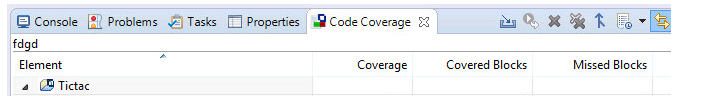
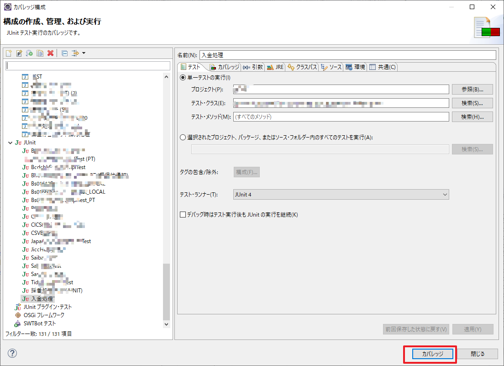
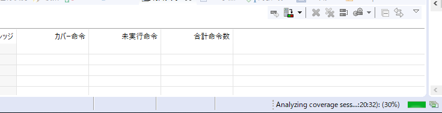
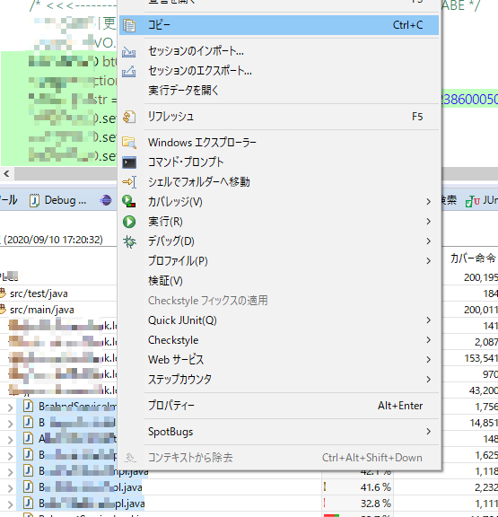
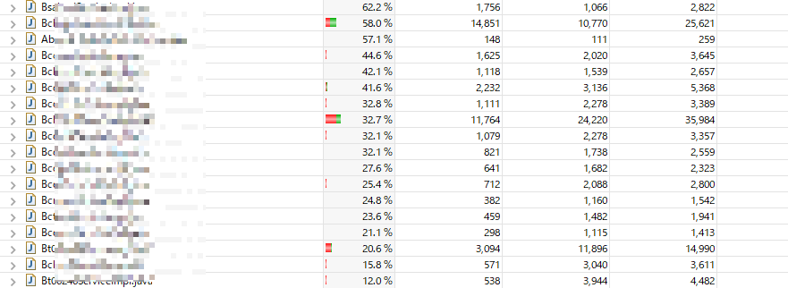
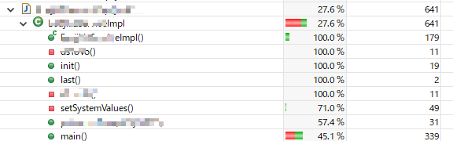
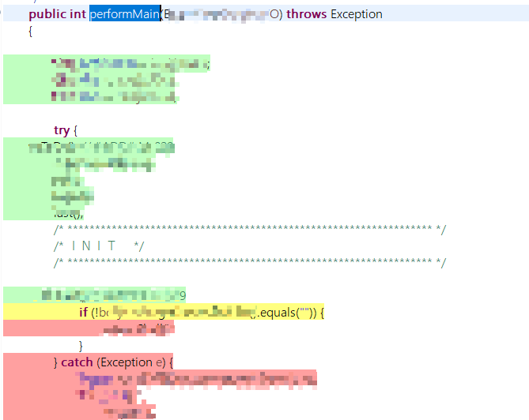
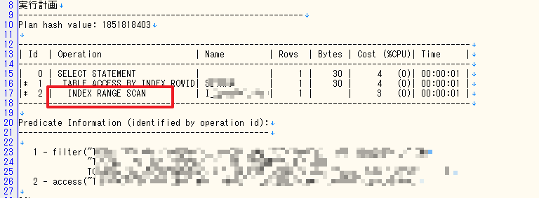

# 思考

通常的情况下第一直觉就是要找到为什么会花这么多时间，然后对于系统瓶颈的部分加以改进。
和客户沟通后，因为种种原因，因为是银行业的关系，无法取得运行的Log，也无法使用相关的数据。唯一的情报来自测试环境和少量测试数据。
这大概是这个任务最大的挑战。
- 无法快速重现问题，找到正确原因。
- 提出的方案无法马上印证结果。

说实在的这有点像咨询业所遇到的情况。
可以列出各种可能性，然后猜猜看可能是哪一个。在真实环境运作后，如果无法改善，在尝试另外一个方案。


# 列出可能性

客户给出了情报是，在三个模块组合进行的业务的时候，才会特别的慢。因此可以把3个模块链接意外的情况排除。
其他的模块也可以先排除。

但每一个模块里面的IF Else组合也是很多的，所以即使是能够跑3个模块的测试数据，也会有些If Else的部分不会被执行的。
这里我突然想到可以使用测试工具里面的覆盖率。看看现有的数据里面，可以覆盖多少比例，然后有多少部分没有跑到过的，需要手动造其他数据来覆盖。

## 使用Eclipse内部工具

使用 カバレッジCode Coverage 来测试覆盖率。




可以参考这里来看如何做。
[コード カバレッジ情報の表示](https://www.microfocus.co.jp/manuals/VC30/Eclipse/GUID-A9994E49-49D0-44DD-B785-FFC82A349907.html)

选这个项目然后运行要检测的程序，运行后就可以看到结果了。




## 可以放到Excel进行统计
选择必要部分复制贴上到Excel

统计后就可以做出美丽报表跟客户汇报了。
当然最重要的还是可以经由排序，排除Coverage的比率是0的模块。
虽然只有3个主要模块，但是这个3个模块里面还引用了外部函数，在进行Converage的时候都可以得到这方面的情报。
在这个实际的运用中，下面的模块是被使用到的。

在有了这些情报后，问题的范围就得到大大的缩小了。

也可以将这些Java档案展开看内部详细的那个函数使用了多少。



## 也可以透过颜色来观察那个部分被运行，或没有被运行。


如下图，因为If条件不满足，红色的部分没有被执行。


# SQL

运行速度缓慢的SQL也是造成夜间Batch缓慢的可能原因。在进行分析了上面部分之后，接下来就要将运行上方是所执行的SQL整理出来，进行调整。

这个时候Oracle的工具可以给我们一些帮助。

首先我们来看一下如何使用。

```sql
SET LINESIZE 1000
SET TIMING ON
SET AUTOTRACE TRACEONLY EXP
SET TERMOUT OFF
SET TRIMSPOOL ON
SET ECHO ON


SPOOL output.LOG


SELECT xxx FROM yyy WHERE a='0010000168' AND b > 20200819 AND c <=20200919 AND d=' ' AND e=2 AND f IN ('4','5','6','7','8') AND g >10000000
AND TO_DATE(g)>TO_DATE(h)-61;

SPOOL OFF
QUIT;
```
执行之后我们会得到如下的结果。


上图没有异常。因此这句SQL不是原因。可以找其他的嫌疑SQL进行测试。
如果发现异常，可以在调整后继续测试，直到满意为止。

# 结论

经过上面的过程方案应该可以做的出来了，接下来就是放到真实环境进行测试。当然如果在测试环境可以重现问题的话是最好的，但可惜现实总是比较有挑战性。

