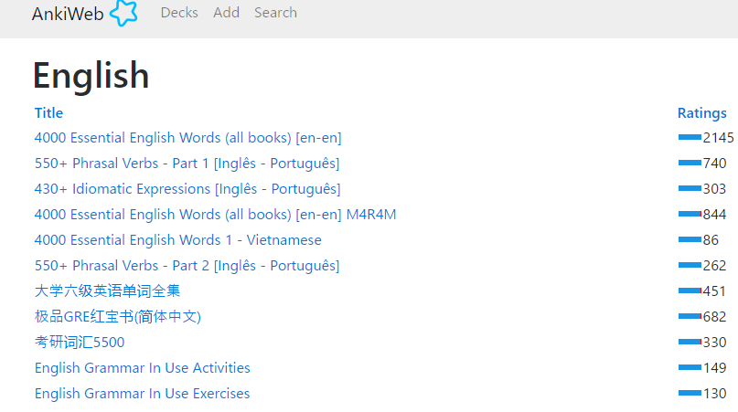
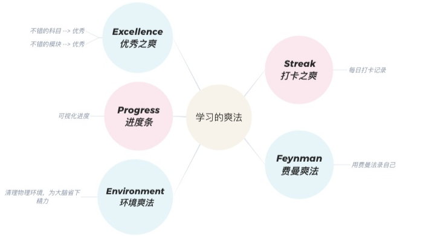
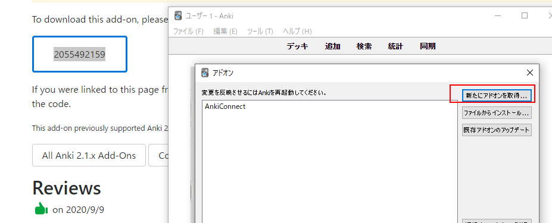
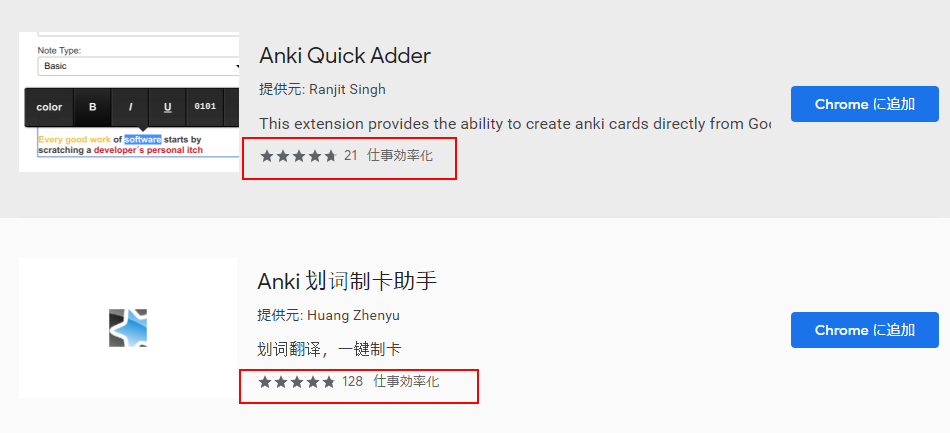
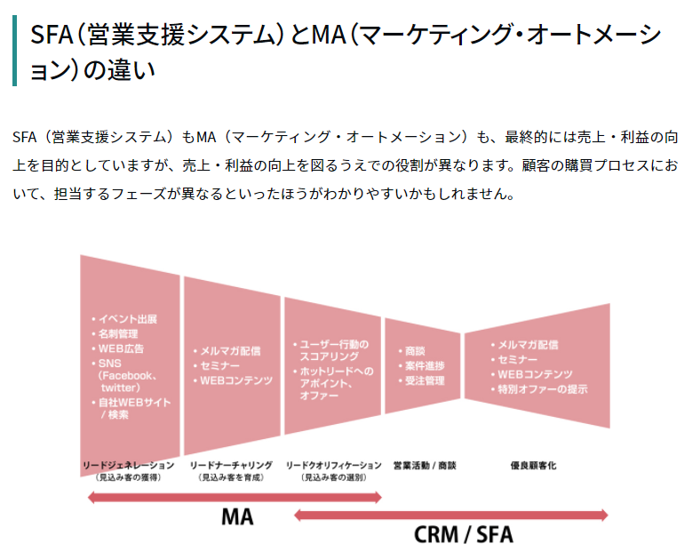
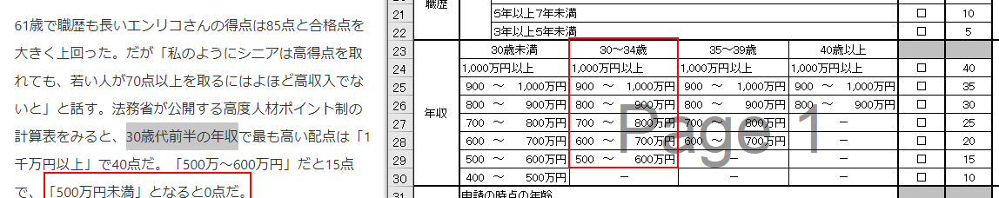

# Ankiは、暗記のための自由/オープンソースソフトウェアである。

為了要記憶的免費軟件。
原始的概念是FlashCard，也就是記憶卡，以前學生時代有些同學經常使用。
下載後可以下載很多Deck來學習。
[Shared Decks - AnkiWeb](https://ankiweb.net/shared/decks/)

# 製作Deck

不過在這裡有個陷阱。看到這麼多免費的學習材料會感到很興奮，不知不覺下載很多。然後就把精力花完了。
真正的學習還沒開始呢。

因此必須先做好學習管理。
[有没有一种让人很爽的学习方法？ - 知乎](https://www.zhihu.com/question/58772932/answer/1295278256)

來喝口雞湯！
> 学会享受学习、get到学习之爽，你不仅能称霸学校，还会是人生赢家。

# 里程碑1

決定要學習的內容。然後根據自身的習慣，強項來安排合適的執行計劃。

# 主要的概念-語言的樹狀結構

## 看看SQL這種查詢語言的文檔，或許會有點心得吧。

樹狀的結構特點就是有個樹幹，然後有分支。

# 每天讀一篇文章然後複習7次？
可以試試看這個網站的免費方案。
[Blinkist: Serving curious minds.](https://www.blinkist.com/en/nc/daily/reader/rare-breed-en)

## 插件下載
[Add-ons for Anki 2.1- AnkiWeb](https://ankiweb.net/shared/addons/2.1)

[Chrome ウェブストア](https://chrome.google.com/webstore/search/anki?hl=ja&)
評價都很高！

當然學習是需要一個閉環的增強回路的。也就是有輸出有輸入有反饋。目前的情況下反饋要從哪裡來呢。

反饋很像是Debug的過程。為了要讓正常的程序運行前除掉可以發現的錯誤。
也是個刻意練習的過程。

像有個叫做一點英語的APP,就很能考慮到這些問題。

不過方法在多，自己的大腦不聽使喚，一開始就犯困，或是覺得沒有勁，那這些方法也可以說與你無緣。

为了避免大脑陷入这种状态，我们可以拿纸写下3H（何时，何地，何事），用3H，明确目标，防止大脑因胡思乱想而拒绝学习。

不积极，没热情，不困才怪。

這也很像是我每天上班的過程呀。

想來想去，精力管理才是主要的目標。如果每天都能夠充滿能量的應付生活各種挑戰。

用身体控制思想，而不是思想控制身体身体是有自主意识的。这部分自主意识与大脑是独立分开的。并且身体的自主意识非常强大。你完全可以用身体控制大脑。当你想起床的时候，不要听大脑的声音。大脑是一个喜欢高热量、习惯及时反馈庸俗的家伙。你只需要做起来，把被子甩开站起来，然后去冲澡。之后庸俗的家伙就会夸自己：“啊我真勤奋啊。都是我大脑的功劳。”干啥啥不行，抢功劳永远第一个。这就是我们的大脑。

# 各種方法的背後要設定獎勵機制

在原子習慣裡面說的設立習慣5步驟中，其中不可缺少的就是獎勵。那這個學習的獎勵會是什麼呢。

准备填的时候会有小雀跃，填完之后会有成就感。

和总体目标的大小成比例：别把奢侈的欧洲14日游作为成功跑完1公里的奖励！
别让它毁了你的目标：如果正在减肥，就别用一顿暴饮暴食奖赏一天的健康饮食，这会弄巧成拙。

[Remember to Reward Yourself](https://www.sparkpeople.com/resource/motivation_articles.asp?id=86)

觉得自己变得强大了-这应该可以成为奖赏
很多人来点赞了- 这肯定是个奖赏

# 脱离模式

不小心发现自己很多年前写的Blog.
感想就是这么多年了自己好像没有什么长进。写的文章也是风格一模一样。
[Step by Step有名人日记](http://bendeq.blogspot.com/)

写作就好像指纹一样对于一件事情每个人都有自己不同的风格。
不过比较令人遗憾的事情是这个与生俱来的风格需要经过雕琢。。。对比其他的文章后感觉自惭形秽。。。

但是要脱离这种不知道什么时候根深蒂固的写作方式貌似不容易。

需要建立新的习惯，新的路径。那还是从简单易操作的方法做起。

# 1-3-5法则

我在一个外国网站上发现了一种比较新颖的，事件驱动的方法，叫1-3-5法则（1-3-5 Rule）。具体如下：假设你一天只能完成一件大事（big），三件中事（medium），五件小事（small），这样你在这一天的To-do List上就只有9件事要完成。
一天能够完成9件事情。这可以说投资保本型了，一天的光阴至少保本了。

# ITサービス業のCX/CRM系のシステム（SFDCなど）
## SFDC（セールスフォース・ドットコム）
[SFDC（セールスフォース・ドットコム）とは | 富士ソフト株式会社](https://www.fsi.co.jp/Salesforce/column/column1.html)

[SFAとCRM、MAの違い ? 今必要なツールを見極める！](https://www.justsystems.com/jp/lab/sfa/sfa-crm-ma.html)

# SFA, MA, BIなどCX/CRMソリューションの知識

## SFA

SFAとは、日本語で「営業支援システム」という意味で、「Sales Force Automation（セールス・フォース・オートメーション）」の略。営業部隊（セールスフォース）が行う「営業活動」を「システム」を活用して「支援」するものです。

SFAは、受注数や売上だけでなく、営業プロセスや案件の進捗、商談の内容などを可視化して管理・共有することで、営業活動の効率化・高精度化を図るのが特徴です。

## MA
MAとは、「Marketing Automation（マーケティング・オートメーション）」の略で、企業のマーケティング活動を自動化するためのシステムのことです。日本語に訳されることは少なく、そのまま「MA」や「マーケティング・オートメーション」と呼ばれます。

MAは、獲得した見込顧客の情報を一元管理し、育成・選別を行い、購買意欲の高い見込顧客として営業にパスするところまでを自動で行います。

## BI

## CX/CRMソリューション 

### CRM
CRMとは、日本語で「顧客関係管理」という意味で、「Customer Relationship Management（カスタマー・リレーションシップ・マネジメント）」の略。顧客との関係を管理しながら、その関係を長期的に深めていくマネジメント手法のことをいいます。

CRMでは、どれだけ優れた製品・サービスを持っていても、それを購入する顧客がいなければビジネスは成り立たないと考え、顧客を起点として事業戦略や営業プロセスを構築・管理していく点に特徴があります。

### CX
[コールセンター｜OKIソフトウェア](https://www.oki-osk.jp/product/crm/column/2018/c71.html)

CX（Customer eXperience：顧客体験、顧客体験価値）
カスタマーシリーズの中でも、多くの解釈があるコールセンター用語です。捉え方によってさまざまな解釈があるため、なかなか実態をつかみにくい言葉だといえます。

「これからはCSではなくCXだ」というような言い方をした場合、CXはCDとほぼ同じような意味を持ちます。つまり、「期待を満たせてうれしい」という心地よさではなく、「そんなことまでしてもらえるんだ！」という驚き（感動）まで引き上げることが大切、という考え方です。そして、顧客の感情を感動にまで引き上げるためには一部門（たとえばコールセンターのみ）では難しいため、企画やマーケティング、営業、実店舗、Web展開、コールセンターなどすべてを含む「全体最適」が重要だともいわれます。CSはコールセンターで追うものだがCXは全体で追うものだ、という考え方です。その具体的な施策として、オムニチャネルがあります。

一方、CXを「良し悪し」から切り離し、「顧客がそこで体験したこと」というフラットなものだと捉える解釈もあります。この場合にCXが指すのは、各タッチポイントで顧客と接触したときに顧客が示す反応です。よいCXが得られればCSが向上するため、よいCXが得られるように頑張り、悪いCXがあった場合は商品やサービスにフィードバックしましょうという考え方をします。「顧客体験」という日本語を直接的に捉えるなら、こちらのほうがシンプルな捉え方だといえるかもしれません。

- SFAは「顧客になるまで」を管理し、CRMは「顧客になってから」を管理する。
- SFAは「営業活動」を支援し、CRMは「マーケティング活動」を支援する。
- SFAは「営業パーソン」を管理し、CRMは「顧客」を管理する。
- SFAは「BtoB」向け、CRMは「BtoB」「BtoC」の両方に使える。

# 原来如此
原本心理一直抱着疑惑的，40岁以上不到年收800，是不是0分？
答案应该是的。
[「すご腕外国人」ようこそ、優遇制度利用で増加中｜出世ナビ｜NIKKEI STYLE](https://style.nikkei.com/article/DGXMZO92885610W5A011C1NZBP00/)

