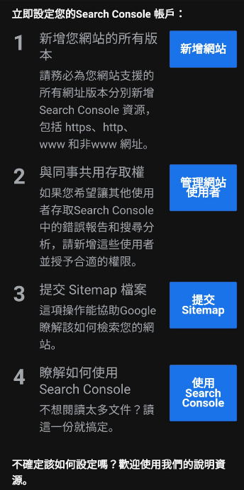

# 網站搭建好了。如何讓Google認識。

 
# 如果想要讓更多人來看你的網站的話。。。

## 發到朋友圈

這是最近幾年最流行的方式了，也顛覆以前百度搜索的商業地位。以前想要曝光網站的話必須要利用SearchEngine。但現在可以發到各種社交工具。

## 但總是有些內容是希望給不特定大眾的

做為碼農經常要利用Google來找問題答案。所以也想要把自己的工作經驗整理好，方便其他碼農也可以透過Google來找到該文章。這個實驗好像蠻有趣的。

# 每天創作真是累人！ 但只要有讀者就會感到欣慰。
好不容易創作了3篇文章了，但自己在Google找半天都沒有找到自己的網站。
想說在等一下吧，又過了幾天在找還是找不到。難得需要去Google登記一下戶口？

想要確認一下自己搭建的網站能否在Google上被找到，可以試試看下面的方法在檢索框裡面
 site:abc.zero21.biz

# 原來Google有站長工具！
肯定要使用與Google搜索最合拍的Search Console。
但這個工具需要確認一下這個網站是不是你的。
確認的方法有很多種。
想要知道更多的話可以看下列網站。
[Verify your site ownership - Search Console Help](https://support.google.com/webmasters/answer/9008080#domain_name_verification)

最快的就是現在自己的網站頁面裡內嵌Google分析的Tag,如此一來只要按個小按鈕就可以完成這個身份確認。

做些設定就可以等著看結果了。如果已經有設定Google Analysis的話它會自動識別去這個網站的擁有者就是我，然後就搞定了。
搞定後會收到如下的郵件。

## 設定完成後

將這個設定好可以代表深山裡的小村落開了一條路可以和外界溝通了。是從0到1的轉變。
當然有多少人會來訪問這個小村落，就要看你能提供什麼有價值的觀光資源了。

