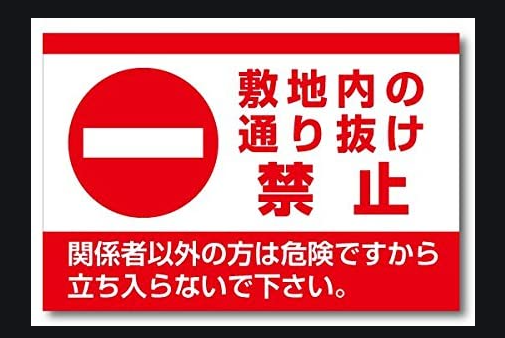

# 本期重點
由幾個場景來學生活日語！

以前學日語使用了語言學習雜誌，內容非常豐富，但有2個需要克服的問題，針對我的學習特性

以前覺得聽幾次就記住了，年紀大了聽幾次也記不太清楚！
學習了高深日語在生活場景中運用的機會很少，也就是說在某一個區塊雖然很熟了，但日常生活區塊確幾乎空白！
去買東西，接孩子等生活場景中，給人一種日語沒有說的很好的印象。

方案
 对日语有兴趣就学吧，不要去想有什么用。很久之前每晚练舞到11点，打魔兽练到登峰造极，现在一点都不碰，再也不沾的时候会后悔吗？呵～人生就是体验。如果总是铺垫以后能用的上的东西，那说到底我们都是在准备死亡。印象是自己小学时候听到家人在念日文的“一 二 三 四”，懵懂的跟着念。不会预知自己有一天竟坐在东京大学的讲堂里。

赤恥【あかはじ】とは
赤面するほどのひどい恥。人前で受けるとんでもない恥ずかしさ。赤っ恥。
「赤」は「明（あか）るい」「明らか」の「明」と同一語源。名詞の上に付くことで、その言葉を強調する「全くの」「すっかり」「明らかな」「それ以外の何物でもない」などの意味を持つ。「赤の他人」「真っ赤な嘘」なども同じ使われ方。

# 故事1

接下來請大家先想像一下場景，假設你是上班族。上司問你為什麼會漏掉一個重要的頁面。
影片播放

接下來講解一下
第一句
真的是太丟臉了。
通常我們第一個想到的是 恥ずかしい 這裡用了
赤恥をかく 來強調在客戶面前感到非常丟臉的情況
赤這個字中文是紅色的意思，日文裡面因為發音和明是一樣的，所以也使用在明顯的，真的是，這種強調的表現。
類似的用法有
「赤の他人」「真っ赤な嘘」

第二句可以提煉成一個句型
どうしてXXXするわけ？ 為什麼會XXX

還有一個單字是可以提出來講講的
那就是抜ける
這個字的用法有很多種，但不管哪一種都是表達著一種從一個地方有一部分脫落的形象。
這裡的用法是漏掉了一張圖片，整個簡報裡面有一張圖片脫落了。的情況。
還有就是在公路上會看到這樣的路牌

路地などを一方から他方に通り抜けること。また、通り抜けられる通路。「通り抜け禁止」
也可以形容人有點掉鍊子，脫線的情況。

另外在工作的場景也經常使用的。
比方說你邀請對方參加會議，對方回答可能是
我可能會中途退出，或中途才進來參加，這個退出就可以用這個字來表達

途中からになるかも、もしくは途中で抜けるかも

或是上班上到一半突然要去接孩子了，也可以和同事說

30分ほど中抜けします

## 成功人士的特徵

1. passion- love what you do
2. work hard
3. focus your energy on one thing
4. keep pushing yourself
5. come up with good ideas
6. improve at what you do
7. serve others
8. persist until you succeed

查里圣约翰访问了500个各个行业的成功人士，整理出这些人共同拥有的8个成功特征。一起来看看，并且互相鼓励吧！
第一点是他们都很有热情。
热情使得他们即使备受打击还能坚持不屑。

第二点是他们都努力工作，这点不需要特别解释。
第三点是他们都每次只集中注意力到同一件事上，而不是同时在很多事情上。
要相信人的精力有限，专注投入才能克服问题。

第四点是他们都一直完善自己，不断的往前。

他们好像具有一种相信自己会不断变强的心态。后天努力、改变策略、和接受指导等等都是他们进步的手段。
第五点是他们都具有好的创意想法。

第六点是他们都持续改善自己正在做的事情。

第七点是他们都以服务他人为目的，更少的以自我为中心，进而推动了世界的进步。
最后一点是他们都很有恒心，能够坚持，毕竟没有什么事业，是一天两天可以完成的。

以上这些核心特性，是各行各业的成功人士所具备的共通性。
这些核心特性向外延伸，搭配在各个领域或行业所需要的专业技能，让这些成功人士在各个领域变得成功！

所以说这八个特性，是成功的核心！

相反的，在各个不同行业尚未取得进展的我们，也可以借由在工作中锻炼，也就是宋代大儒王阳明先生所说的『在事上磨练』，进而锻炼心性，让自己备齐以上8个特性。这个心，不是一般的心，是成功的核心！
让我举个简单的例子就会容易明白。
我儿子小的时候逼他弹钢琴，他经常的反应就是说，我不想要当音乐家，为什么要弹钢琴！ 然后就坐在钢琴前，以极差的态度练习。同样的道里，学英文的时候，他也说，我不想要当美国人，为什么要学英文！
做老爸的我只能每每告诫他，儿子，你正在学习的是成功学，而不是钢琴，也不是英文！

学习的科目有很多种，如果以技能来看，可能都自己都抱着怀疑的态度，无法确定这些技能将来是否还是和现在一样有用，但锻炼出遇到困难时不感到退缩，不发脾气，不断尝试的美德，肯定在未来还是有用！

## 2.塑造典型冲突 场景背后会有一个冲突，可能是未达预期，可能是遭受失败。
## 3.提出核心疑问 为什么会产生这种冲突？我们应该如何解决？

# 第一步：明确主题（What）

# 第三步：找到关键答案（How）

## 1.推理法。层层推进，找到问题的根源。

## 2.归纳法。把一系列答案，归总于几个大类，然后分类表述。

## 3.步骤法。给出具体的操作步骤。

早上是一天生活的起点。掌握了起点，有了顺利的开始，接下来要变得顺利，也就容易了。那早上起来，有什么过程是可以用来帮助我们更快的进入状态的呢？
如果可以的话，沐浴在清晨的日光中起床，自然而然就能切换到活动模式，但光照太阳，这个并不能让大脑完全的清醒。
大脑要完全开始变得活络，据说需要两个小时的时间。这从开机到开机完成的时间，好像比较长。
起床之后首先要让大脑,做热身体操, 帮助大脑更快进入状态，迎接一天的挑战。

散步，或是简单的脚的活动。
散步可以让全身的血液，加快流到脑部。
如果偶尔变换散步的路线，大脑为了确保安全就会自然的开始收集周围的各种的情况，更加变得活泼起来，

	
整理房间
整理房间的时候，必须要判断如何整理，前额叶是掌管选择判断的，所以在整理房间的时候，你的大脑前额叶就会开始有活动，对大脑来说是很好的准备体操

做早餐
做料理时，因为是创造性的活动，要使用大脑前额叶来判断，对大脑来说是很好的刺激。

整理花园
动手做，另外接触自然也可以顺道取得安抚情绪的效果。

和别人打招呼和聊天
向家人问早安，或把孩子们叫起床等等要使用使用到发声的部分。聊天的时候因为要组织聊天内容，也需要大脑前额叶来判断。

然后或是10分钟以上朗读。

朗读是眼睛跟嘴巴的运动。眼睛读入文字在大脑里面理解后，再由嘴巴输出，这三个部分都同时参与的关系，是很好的运动。一个人住的情况，没有机会一早起来和家人对话，活用朗读是很重要的，朗读的时候就假装要朗读给别人听一样，效果更好。

动手动口动脚呢，就是使用到大脑里面的负责这些运动部分的机能，因为是在脑的表面的中央附近负责的，这里被活动到也就代表血液已经流经脑的大部分区域才能到达这个部位，差不多可以说流经全体，脑也开机完成，可以开始应付一天的各种挑战了。

人的脑袋不是机械，所以24小时都保持同样的性能，是不可能的，在生理上，有活泼的时间有想要休息的时间的周期，脑的活动周期跟生活的周期要是能够保持一致。那是最理想的，可以在需要用脑的时候有最清晰的思维，想休息的时候大脑也可以得到身体的配合。但是生活的节奏要是不安定的话，这两个周期就很难保持一致，所以每天养成规律的生活习惯，是有强大的科学理论支撑的！

