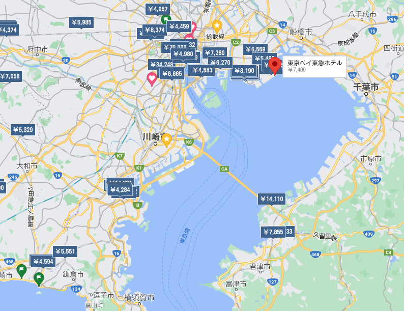

# 新普安旅行记

这里是位于千叶县新普安的日出町。面对东京湾，但四周望去都是陆地的关系，看起来像个湖一样。
刚刚到达的时候，正好是奥运结束后第一天，所以很多地方还保留着交通管制的标签。
因为台风外围气流的影响，所以海浪和海风都很大，很难想象平常这里是千叶县的一个具有白沙滩的海水浴场。
弟弟拿着游泳圈周围的大叔们都以一种很有趣的眼神看着他。

这次住的酒店外面看过去就是面朝大海。还有一片大草坪。光这个风景就值得了。这个酒店因为奥运使用的关系，所以刚刚到达第一天还有很多管制，电梯也是分别使用。
疫情期间街上也没有人。也不太敢到处移动，大多数时间都在酒店里面。

酒店的班车开23分钟就到迪士尼。酒店里头，年轻人还蛮多的。分享到了很多快乐气氛。

<iframe width="720" height="405" frameborder="0" src="https://www.ixigua.com/iframe/6996325911930864141?autoplay=0" referrerpolicy="unsafe-url" allowfullscreen></iframe>