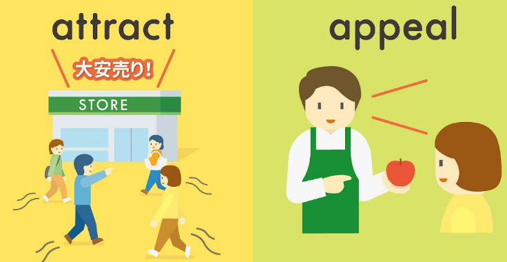
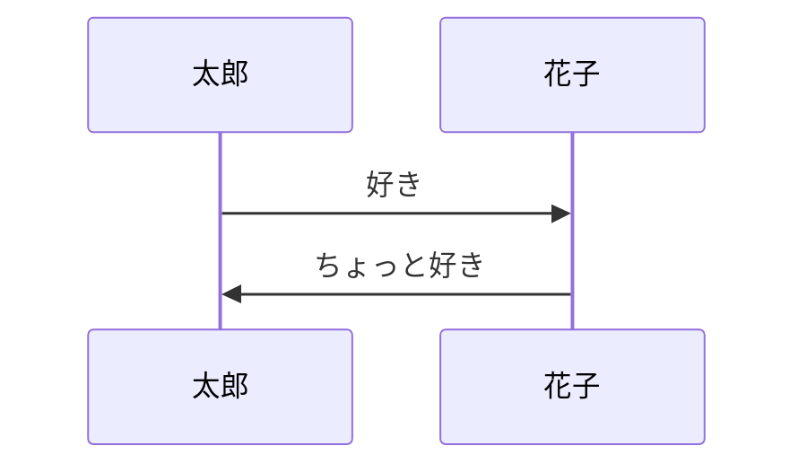

<iframe src="https://embed.ted.com/talks/john_doerr_why_the_secret_to_success_is_setting_the_right_goals" width="854" height="480" style="position:absolute;left:0;top:0;width:100%;height:100%" frameborder="0" scrolling="no" allowfullscreen></iframe>

 
# 第二步：明确与读者的联系（Why）

<iframe src="https://embed.ted.com/talks/chieh_huang_confessions_of_a_recovering_micromanager" width="854" height="480" style="position:absolute;left:0;top:0;width:100%;height:100%" frameborder="0" scrolling="no" allowfullscreen></iframe>

# an xxx appeal those 

## hyped
much-hyped,super hyped
<iframe width="855" height="427" src="https://www.youtube.com/embed/HPopJb5aDyA" title="YouTube video player" frameborder="0" allow="accelerometer; autoplay; clipboard-write; encrypted-media; gyroscope; picture-in-picture" allowfullscreen></iframe>

[Getting Title at 19:09](https://youtu.be/oCwEYi_JjEQ?t=393)
## for its part
<iframe width="855" height="427" src="https://www.youtube.com/embed/oCwEYi_JjEQ" title="YouTube video player" frameborder="0" allow="accelerometer; autoplay; clipboard-write; encrypted-media; gyroscope; picture-in-picture" allowfullscreen></iframe>

