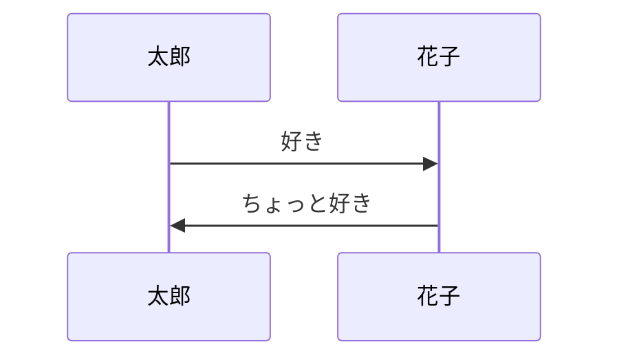

# 学习下面常用句子
- なんてこった
- 
 
# 第二步：明确与读者的联系（Why）

## 1.勾勒典型场景 用一个大家经常遇到的情景来引入。
## 2.塑造典型冲突 场景背后会有一个冲突，可能是未达预期，可能是遭受失败。
## 3.提出核心疑问 为什么会产生这种冲突？我们应该如何解决？

# 第一步：明确主题（What）

# 第三步：找到关键答案（How）

## 1.推理法。层层推进，找到问题的根源。

## 2.归纳法。把一系列答案，归总于几个大类，然后分类表述。

## 3.步骤法。给出具体的操作步骤。
```plantuml
a->b

```

