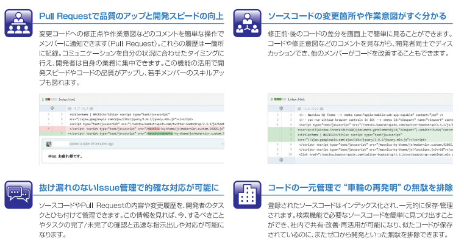

# 本期重點

 
# rearing

# per annum

<iframe width="855" height="341" src="https://www.youtube.com/embed/QzfFjPw_-JI" title="YouTube video player" frameborder="0" allow="accelerometer; autoplay; clipboard-write; encrypted-media; gyroscope; picture-in-picture" allowfullscreen></iframe>
[Improve Your English Pronunciation](https://youglish.com/pronounce/per%20annum/english?)
# of up to

# said to total
https://youglish.com/pronounce/%20said%20to%20total/english?

# cite
 cite · 〔～を〕引用｛いんよう｝する、〔～を〕引証｛いんしょう｝する・He cited the famous phrase in chapter 2. : 彼は第2章の有名な語句を引用しました。 · 
[Improve Your English Pronunciation](https://youglish.com/pronounce/cite/english?)

# 立ち並んで
[Improve Your Japanese Pronunciation](https://youglish.com/pronounce/%E7%AB%8B%E3%81%A1%E4%B8%A6%E3%82%93%E3%81%A7/japanese?)

# 視点　捉えられ
<iframe width="855" height="341" src="https://www.youtube.com/embed/mPvXL8XbI_Y" title="YouTube video player" frameborder="0" allow="accelerometer; autoplay; clipboard-write; encrypted-media; gyroscope; picture-in-picture" allowfullscreen></iframe>

[Improve Your Japanese Pronunciation](https://youglish.com/pronounce/%E6%8D%89%E3%81%88%E3%82%89%E3%82%8C/japanese?)

# 辿りたい

[Improve Your Japanese Pronunciation](https://youglish.com/pronounce/%E8%BE%BF%E3%82%8A%E3%81%9F%E3%81%84/japanese?)

# 組立って
[Improve Your Japanese Pronunciation](https://youglish.com/pronounce/%E7%B5%84%E3%81%BF%E7%AB%8B/japanese?)

# git flow

[https://www.hitachi-solutions.co.jp/-/media/Project/DefaultSite/Products/pdf/g/github_macnica_pdf.ashx](https://www.hitachi-solutions.co.jp/-/media/Project/DefaultSite/Products/pdf/g/github_macnica_pdf.ashx)

# mergeは必ずnon fast-forwardで！

# 仕立て

# gitlab windows
[WindowsでGitLabを構築(Docker) - Gobble up pudding](https://gup.monster/entry/2020/04/13/023005)

<iframe width="855" height="341" src="https://www.youtube.com/embed/ZYfNT4SG5Ww" title="YouTube video player" frameborder="0" allow="accelerometer; autoplay; clipboard-write; encrypted-media; gyroscope; picture-in-picture" allowfullscreen></iframe>