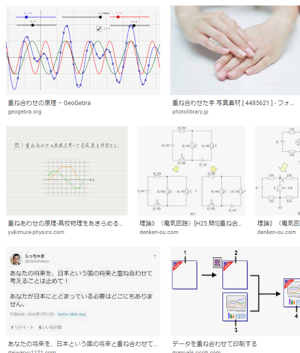

# Git操作演練
[Gitを使ってPull Requestを投げるまで - Qiita](https://qiita.com/takamii228/items/80c0996a0b5fa39337bd)

[https://www.bilibili.com/video/BV1p7411d7Fv/?spm_id_from=333.788.recommend_more_video.6](https://www.bilibili.com/video/BV1p7411d7Fv/?spm_id_from=333.788.recommend_more_video.6)

https://www.bilibili.com/video/BV1p7411d7Fv?p=1&t=187.3

# git rebase

- 提交記錄的合併 尚未提交到遠程倉庫之前
- 合併2個Branch
- 中間如果有衝突》中斷》》Merge》》git rebase --continue

# git pull=get fetch + git merge

git fetch+git rebase 可以避免分叉


`git log --graph pretty....`
[Notion – The all-in-one workspace for your notes, tasks, wikis, and databases.](https://dewjjj.notion.site/dewjjj/Git-9d51502375d5407faf246cb1caf1b16a)
[Sourcetree | Free Git GUI for Mac and Windows](https://www.sourcetreeapp.com/)
[这才是真正的Git——Git实用技巧](https://zhuanlan.zhihu.com/p/192961725)

# git fetch
[【初心者向け】git fetch、git merge、git pullの違いについて - Qiita](https://qiita.com/wann/items/688bc17460a457104d7d)

# git tag
[git tagの使い方まとめ - Qiita](https://qiita.com/growsic/items/ed67e03fda5ab7ef9d08)

不經過PUSH的話，TAG不會被上傳到遠方。
tagは作成しただけではリモートには反映されないのでpushしてやる必要がある。

# git flow
[Git-flowをざっと整理してみた | DevelopersIO](https://dev.classmethod.jp/articles/introduce-git-flow/)

```console
[core]
	repositoryformatversion = 0
	filemode = false
	bare = false
	logallrefupdates = true
	symlinks = false
	ignorecase = true
[user]
	name = a
	email = a@b.c
[remote "origin"]
	url = C:/work/tmp/gittest/remote
	fetch = +refs/heads/*:refs/remotes/origin/*
[branch "master"]
	remote = origin
	merge = refs/heads/master
[branch "newbranch111"]
	remote = origin
	merge = refs/heads/newbranch111
[branch "feature/ftest1"]
	remote = origin
	merge = refs/heads/feature/ftest1
```

# 今日照片


# 常識を覆した

[Improve Your Japanese Pronunciation](https://youglish.com/pronounce/%E8%A6%86%E3%81%97%E3%81%9F/japanese?)

# 差し支えありません 問題ありません
[Improve Your Japanese Pronunciation](https://youglish.com/pronounce/%E5%B7%AE%E3%81%97%E6%94%AF%E3%81%88%E3%81%82%E3%82%8A%E3%81%BE%E3%81%9B%E3%82%93/japanese?)
# 重ね合わせて



[Improve Your Japanese Pronunciation](https://youglish.com/pronounce/%E9%87%8D%E3%81%AD%E5%90%88%E3%82%8F%E3%81%9B/japanese?)