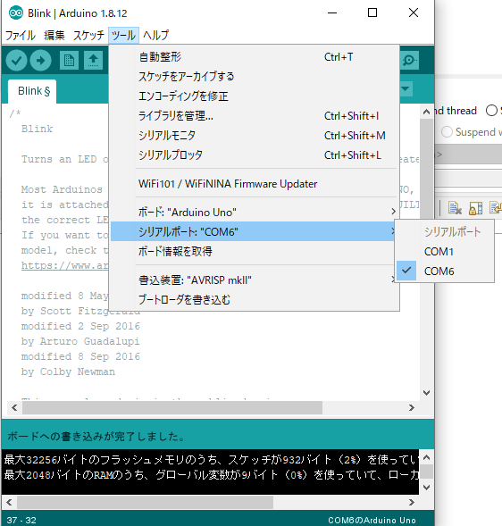

- [健康親子生活園](#健康親子生活園)
- [Elegoo Nano Board ATmega328P](#elegoo-nano-board-atmega328p)
- [播放器](#播放器)
- [幻想　げんそう](#幻想げんそう)
# 健康親子生活園


# Elegoo Nano Board ATmega328P


[互換性ELEGOO Arduino用 Nanoボード](https://sys-guard.com/post-19042/)

[CH341SER.ZIP - 南京沁恒微电子股份有限公司](http://www.wch.cn/downloads/CH341SER_ZIP.html)

[Arduinoの最初の一歩](https://n.mtng.org/ele/arduino/tutorial001.html)
```c
//blink embeded led
void loop() {
  digitalWrite(LED_BUILTIN, HIGH);   // turn the LED on (HIGH is the voltage level)
  delay(100);                       // wait for a second
  digitalWrite(LED_BUILTIN, LOW);    // turn the LED off by making the voltage LOW
  delay(1000);                       // wait for a second
}
```


[Arduino のすすめ](https://n.mtng.org/ele/arduino/)

[Arduino Nano - スイッチサイエンス](https://www.switch-science.com/catalog/2554/)

[https://www.arduino.cc/en/uploads/Main/Arduino_Nano-Rev3.2-SCH.pdf](https://www.arduino.cc/en/uploads/Main/Arduino_Nano-Rev3.2-SCH.pdf)
# 播放器

[DFPlayer Mini を使ってみる](https://blog.techlab-xe.net/craft-use-dfplayer-mini/)

[500円以下のArduino用mp3プレーヤー”DFPlayer Mini”で適当なもの作ってみた - EeePCの軌跡](https://arkouji.cocolog-nifty.com/blog/2016/07/500arduinomp3df.html)

[Arduino nanoで超音波センサー(HC-SR04)を使ってみた。](http://blog.robotakao.jp/blog-entry-80.html)


[Arduino を用いて LCD に文字を表示 - 基礎からの IoT 入門](https://iot.keicode.com/arduino/arduino-project-lcd.php)


# 幻想　げんそう
- 楽しめるそうです。
- 目にする機会
[Improve Your Japanese Pronunciation](https://youglish.com/pronounce/%E7%9B%AE%E3%81%AB%E3%81%99%E3%82%8B/japanese?)
- 目立っている
[Improve Your Japanese Pronunciation](https://youglish.com/pronounce/%E7%9B%AE%E7%AB%8B%E3%81%A3%E3%81%A6%E3%81%84%E3%82%8B/japanese?)
<iframe width="855" height="341" src="https://www.youtube.com/embed/ISoN-YmjTqg" title="YouTube video player" frameborder="0" allow="accelerometer; autoplay; clipboard-write; encrypted-media; gyroscope; picture-in-picture" allowfullscreen></iframe>

- 仮想　かそう
- より理解が深まることでしょう
- ひと工夫こらされて　凝らされて　工夫

- を始めとして
[Improve Your Japanese Pronunciation](https://youglish.com/pronounce/%E3%82%92%E5%A7%8B%E3%82%81%E3%81%A8%E3%81%97%E3%81%A6/japanese?)

- つぶさに　わかる　わけです
[Improve Your Japanese Pronunciation](https://youglish.com/pronounce/%E3%81%A4%E3%81%B6%E3%81%95%E3%81%AB/japanese?)
