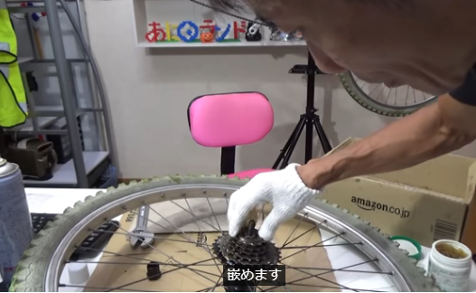

# 今日照片
最近的天氣很好。拍攝於東部圖書館前。

# 着実に ちゃくじつ

# 塡める／嵌める（はめる）

# hordes of

[Improve Your English Pronunciation](https://youglish.com/pronounce/hordes%20of/english?)

# in the run-up
[Improve Your English Pronunciation](https://youglish.com/pronounce/the%20run%20up/english?)
>in the runup to ～の前段階で、～の準備段階で、～の直前で、～の前哨戦で、～に先駆けて

# among those whose ....as well as those ..

# have to do with

[Improve Your English Pronunciation](https://youglish.com/pronounce/had%20to%20do%20with/english?)

# 移り変わり　じっくり　観察して楽しめる
[Improve Your Japanese Pronunciation](https://youglish.com/pronounce/%E7%A7%BB%E3%82%8A%E5%A4%89%E3%82%8F%E3%82%8A/japanese?)

[Improve Your Japanese Pronunciation](https://youglish.com/pronounce/%E3%81%98%E3%81%A3%E3%81%8F%E3%82%8A/japanese?)

