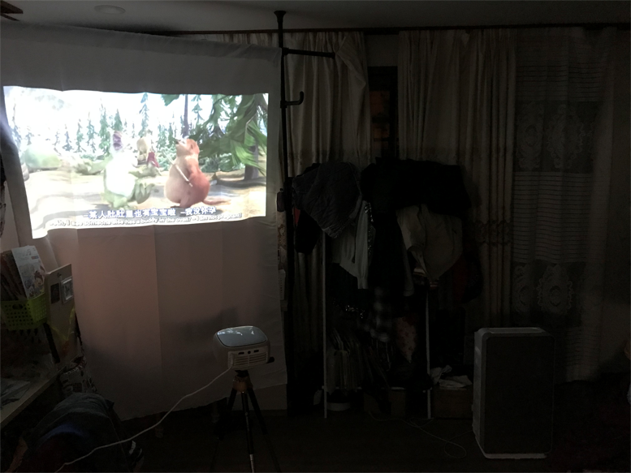

# 本期重點
[Arduino電子工作-Passive Buzzerの使い方・制御方法まとめ](https://taku-info.com/arduino-passive-buzzer/)

[小型のMP3プレーヤーモジュールDFPLayerの使い方 - hrendoh&#039;s tech memo](https://blog.hrendoh.com/how-to-use-dfplayer-mini/)

[DFPlayer_Mini_SKU_DFR0299-DFRobot](https://wiki.dfrobot.com/DFPlayer_Mini_SKU_DFR0299)

[500円以下のArduino用mp3プレーヤー”DFPlayer Mini”で適当なもの作ってみた - EeePCの軌跡](https://arkouji.cocolog-nifty.com/blog/2016/07/500arduinomp3df.html)

 
# it affords vistors/as a view/glimpse

[Improve Your English Pronunciation](https://youglish.com/pronounce/affords/english?)

# seeks to 

[Improve Your English Pronunciation](https://youglish.com/pronounce/seeks/english?)

<iframe width="855" height="341" src="https://www.youtube.com/embed/Ybql5QY-1Oc" title="YouTube video player" frameborder="0" allow="accelerometer; autoplay; clipboard-write; encrypted-media; gyroscope; picture-in-picture" allowfullscreen></iframe>

# on the premisesとは。意味や和訳。敷地内［構内，店内］

[Improve Your English Pronunciation](https://youglish.com/pronounce/on%20the%20premises/english?)

# 誇る
[Improve Your Japanese Pronunciation](https://youglish.com/pronounce/%E8%AA%87%E3%82%8B/japanese?)

# a fish called wanda
<iframe width="1237" height="696" src="https://www.youtube.com/embed/0WTwVpEEMps" title="YouTube video player" frameborder="0" allow="accelerometer; autoplay; clipboard-write; encrypted-media; gyroscope; picture-in-picture" allowfullscreen></iframe>

# titular 
· 1 肩書きのある人 
· 2 名前［題名］が取られた人［もの］；《教会》名義司教 
· 3 名義［肩書き］だけの人
[Improve Your English Pronunciation](https://youglish.com/pronounce/titular/english?)

# stuttering 
stuttering 【名】吃音・How did he overcome his stuttering? : 彼は、吃音を治せたの？

[Improve Your English Pronunciation](https://youglish.com/pronounce/stuttering/english?)
[Michael Palin - Wikipedia](https://en.wikipedia.org/wiki/Michael_Palin)

# famed
[Improve Your English Pronunciation](https://youglish.com/pronounce/famed/english?)

名詞 · 擁護者. a person who pleads for a cause or propounds an idea. 主義や主張を擁護する人。 言い換え · 弁護士 弁護人

advocate 【他動】 〔論争などにおいてある意見を〕主張する、推奨する、支持する、唱道する・I advocate 

# how things played out
[Improve Your English Pronunciation](https://youglish.com/pronounce/how%20things%20played%20out/english?)

# whatever the case may be

<iframe width="855" height="341" src="https://www.youtube.com/embed/44g4_KAjqaI" title="YouTube video player" frameborder="0" allow="accelerometer; autoplay; clipboard-write; encrypted-media; gyroscope; picture-in-picture" allowfullscreen></iframe>

# gearing up
[Improve Your English Pronunciation](https://youglish.com/pronounce/gearing%20up/english?)

# strained relationship

[Improve Your English Pronunciation](https://youglish.com/pronounce/strained/english?)

# pictures of the day

