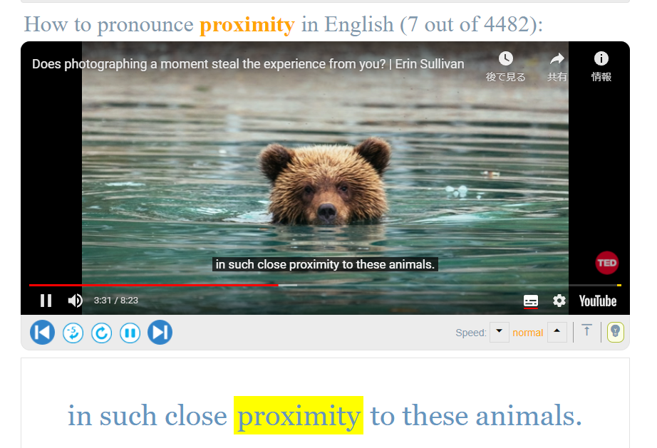
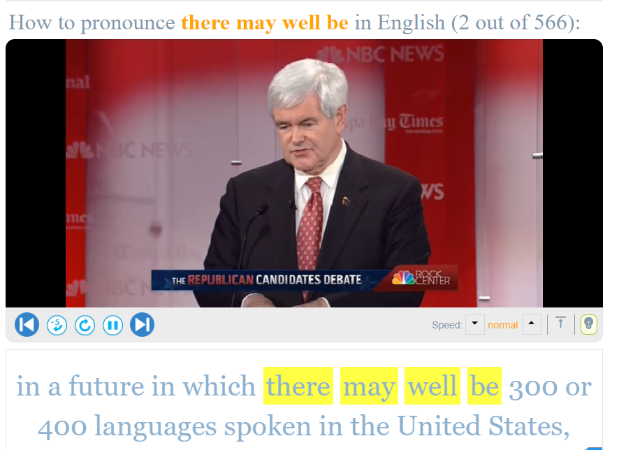

# 每天陪小孩做作業一人15分鐘
> 這是一種投資，週末放風了，下週繼續，悅只要大人不在身邊就偷雞摸狗，該如何是好。

 
# 本週小目標 1212
- 持續關注小朋友之間的矛盾所引發的家長間的衝突
  - 一張圖畫的不錯但上面寫了白雪行機的名字，對方家長不爽了
- 在知道了托益成績後排定再度挑戰計劃
- 學習溝通並且服從組織，放棄固有的沒有必要的小堅持，盡快達成共識並推展工作
  - 畢竟現在做的事情長遠來看意義不大，何必做無謂的堅持或者非要自己編程？
- 把圖或是PPT做的好一點效率高一點
  - [新的活动图测试语法和功能](https://plantuml.com/zh/activity-diagram-beta)
- 有工程師思維，模塊化，還有提升數量級。
- 打印大小海報
- 閱讀購買的新書
- 想想福音聚會彈琴的問題，尋求長遠解決方案
- 想想如何有科學性的長期經營自己的小事業，而不是只像工作室一樣的江郎才盡之時就歇業了，或是無法持續有產出。

# 小目標
- 思考問題，解決問題。
- 把手上可以做到事情發揮創意做好。

# 語言學習鍛煉
每天30分鐘。
## venue
[Improve Your English Pronunciation](https://youglish.com/pronounce/venue/english?)
## proximity

[Improve Your English Pronunciation](https://youglish.com/pronounce/proximity/english?)
## there may well be

[Improve Your English Pronunciation](https://youglish.com/pronounce/there%20may%20well%20be/english?)
> 【英語】1分でわかる！「may well 」の意味・使い方・例文 ...https://study-z.net › 英語 › 英語の熟語まず、ひとつめの意味は「おそらくVだろう」です。Mayは「～だろう」wellは「十分に」という意味があるので、合わせると「十分にあり得るだろう」という ...
[【英語】1分でわかる！「may well ○○」の意味・使い方・例文は？ドラゴン桜と学ぶ英語主要熟語 - Study-Z ドラゴン桜と学ぶWebマガジン](https://study-z.net/31672)

