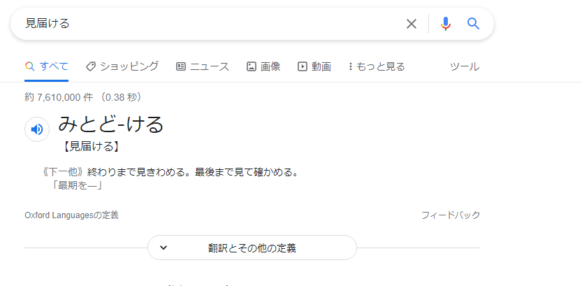
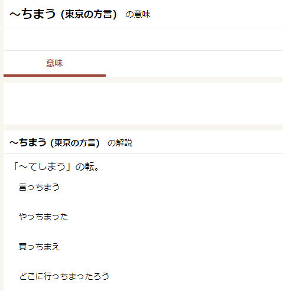

# 每天陪小孩做作業一人15分鐘
> 這是一種投資
> 準備新的聖經內容
> 弟弟也可以一起背

 
# 每天進步事項

# 小目標
- 主日禱告操練

# 語言學習鍛煉

## as has their son ...
[As的完全倒装句_Aliz_-CSDN博客_as倒装](https://blog.csdn.net/weixin_41417982/article/details/81534332)
[求as引导倒装句的用法（……也一样） - 柯帕斯英语网](https://www.cpsenglish.com/question/4061)
[Improve Your English Pronunciation](https://youglish.com/pronounce/as%20has%20their/english?)

## votes cast by people ...
[Improve Your English Pronunciation](https://youglish.com/pronounce/votes%20cast%20by/english?)

