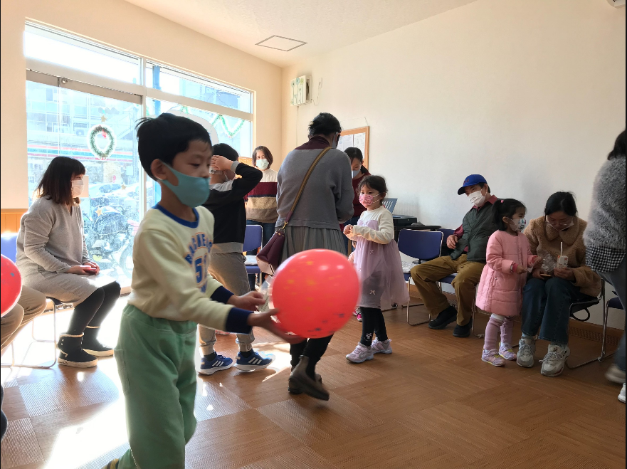

# 新會所的第一次的福音聚會


 
# 各環節都奇妙的配合很好，令人讚美神在我們弟兄姐妹中運行完成這工
本來回家後覺得很累沒有回想，但晚餐時候姐妹提起，細細一想，我心我靈立即興起讚美。




# 小目標
- 今天也是年假的第一天假期，稍微考慮一下這個假期想做的事情，不設限的頭腦風暴一下
  - 旅遊。。。但要去哪裡何時去合適，聽說這三天有暴風雨
  - 去趟好事多
  - 請弟兄姐妹到家吃飯
  - 大掃除包括魚缸
  - 拍視頻

# 語言學習鍛煉

```mermaid
gantt
dateFormat  YYYY-MM-DD
title Adding GANTT diagram to mermaid
excludes weekdays 2014-01-10

section A section
Completed task            :done,    des1, 2014-01-06,2014-01-08
Active task               :active,  des2, 2014-01-09, 3d
Future task               :         des3, after des2, 5d
Future task2               :         des4, after des
```


