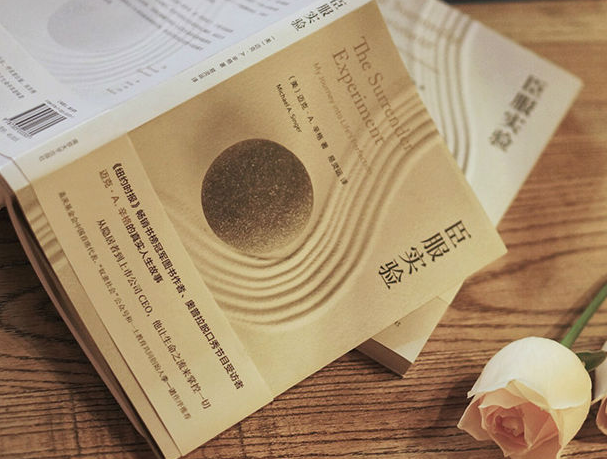

# 臣服的功夫

## 《臣服实验》“寻找内心的平静”这一终极目标帮助作者坦然面对生命带来的一切

前一段时间，听了一本书《臣服实验》，目前听了一半。据说，国内很多人都看过，读过，听过，推荐过这本书。书中描述了作者传奇的一生，从隐居者到上市公司CEO。他一生不主动做任何计划和规划，任由自己在命运的长河中漂浮。

在我进企业这一年一直在做同一个项目。前半年工作上经常有意见的冲突。有时候冲突还比较大的。然后在冲突之中。我猛然间领悟了什么叫臣服。我发现我一直在挣扎逆流而上，好像有点用力过猛。

于是我开始揣摩如何“臣服”。

“臣服”这个词往往让人联想到“软弱”“认输”或“投降”，然而灵性上的臣服其实正好相反，它不是向某样事物屈服，而是有意识地放弃一部分自我。

简单的说是通过“放弃”“我”的偏见和喜恶，“臣服”于“生活”本身。

不知从何时起，对于经常有的意见冲突，我不是思维和情绪的体验者，而是观察者。

以前我还不是观察者的时候总是非常入戏。一直随着“我”的偏见和喜恶而闻鸡起舞。但学会了放弃这部分难搞的自我后，生活真正有点改变。

好像比较看顺一切了。也能分辨所谓的大我与小我。学习去看这个宇宙。我这样把自己的角度练习扭转后，很开心，随着这样好得转变，心灵也越来越安宁。

我觉得这应该不是鸡汤。因为心灵安宁后，然后神奇的事情发生了。

半年前领导突然说，内部调动，你到那个组去吧，那里适合你。新的篇章开始了。我也不停的操练说“yes!” 即使被分配到去带领一个说英文的Team。

半年来说真的，顺着流真的太省力了。。而且经常有新的惊喜。

我想我也正在进行属于我的《臣服实验》。

