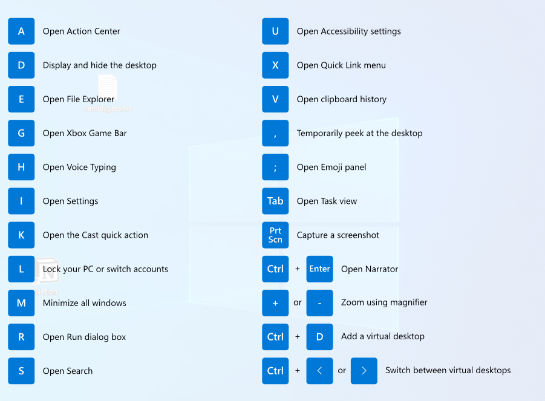

# 介绍微软的一个强大工具PowerToys

## 名字带有 Power，想必是非常给力的。

  
  
## 支持版本
Windows 11 (全部支持)
Windows 10 v2004 (19041) 之后的版本

## 下载
需要科学上网下载安装包
[Release Release v0.63.0 · microsoft/PowerToys](https://github.com/microsoft/PowerToys/releases/tag/v0.63.0)

也可以使用命令行下载
`WinGet install powertoys`

## 概要

收购了Github之后，微软越来越贴近码农了。

先后发布了VS Code、Windows Terminal、Linux子系统(WSL)等免费服务。
这里介绍的PowerToys工具集也不例外——开源且免费。

将Power Toys开源，并且开放了API,像VSCODE一样，进步指日可待。后面会出现更多有创意的第三方工具，这些功能可能会比收费的软件还好用。

听说这个工具的起源，可以回溯到Win95、XP时代。古老用户们可能对这个微软个官方工具集很熟悉。

## 主要功能

功能实在太多了，这里就先说明几个。因为要搭配快捷键，所以记住快捷键才能发挥最大力量。

### 图片提前文字
#### win+shift+t
这功能使用OCR识别图片里的文字并且复制到剪贴版，而且可以同时辨别混合了中文，外文的图片。无法辨识的时候还会非常直观的让你知道，感叹设计者的用心。

像这样模糊带背景的文字也能完全正确辨识

### 像MAC一样的搜寻:PowerToys Run
#### alt+space

### 其他各种神奇功能
首先要记得如何调出小抄看一下哪些快捷键可以使用
#### ShortcutGuide
#### 起動方法 Win+Shift+/
ShortcutGuide会列出当前可用使用的快捷按钮

## 结论
免费又大碗，加上工作的各种场景都能用的上，强烈推荐安装来使用看看。

