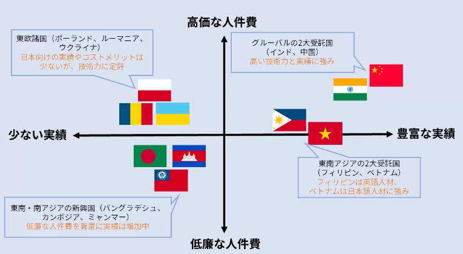

# 对日软件offshore开发之体验

## 日元贬值，人工成本上涨下的软件offshore开发

 
写写小文章也没有做调查，就我的认知，对日软件开发大概少说也有超过20年以上的历史了。

2006 年在上海参加第一个对日项目的时候，当时记得10块钱就可以吃到4菜一汤加酸奶的高级工作餐。但吃了不到一年就变成2菜一汤了。下班后晚餐也是50元就可以在打浦桥附件点3样菜，一瓶酒。到了2016年50元只能吃一碗拉面。

随着经济的起飞当然人工的成本也一直上涨。以前在公司内部也经常看到鼓励日本的Sales接单后，尽量使用offshore开发的邮件。当时公司内部的日语教育，素质教育也一直在追赶，为了要达到即使offshore开发也可以追上在日本本地开发也能够达到的质量。

想当年真是一篇欣欣向荣的美景呀。当时日企在上海的各个分公司也在做外包，当时还去新日铁面试过。感觉这个跟软件是完全搭不上边的重工业公司怎么也来做外包了。会说日语的人才也越来越多，就我住的小区一栋大楼里就有几户都是日本语堪能。

但花无百日红，随着在上海开发的人员单价节节攀升，开发的工作逐渐移转到大连，毕竟在上海的生活成本那么高，单价只有一直上涨的可能。但说上海没有对日外包了吗？虽然少但还是有的。

但我想带来致命打击的，是从今年以来日元的巨大贬值吧。

从17年以来我就来到日本工作，前天公司的大老板在发表谈话的时候，就语重心长的说，今年可以说是外包的成本高于在本地开发成本的元年。从以前的多少赚一点，到现在的外包一次就赔一次的情况，今年以来是第一次。而且随着日元可能长期维持在这个价位，所以今年（财务年度2023年），我们公司不打算进行外包了。

这个发言一出其他的中国同事就提问了，是要进行去中国化吗？老板解释说不要如此想，主要是要给我们所服务的客户带来低成本高价值的服务，才不得不出此策略，毕竟我们是替他们干活的。目前还外包给印度，菲律宾，但随着日元的贬值，带来的影响是全面性的，但在日本要找会说英语的人才，成本加上去的话还是采用印度的外包比较便宜，所以印度外包还将继续实施。

看来一切都是以成本为依归呀！

初此之外新的策略是进行near shore 外包，也就是公司今年要在日本的3，4线城市像是群马县呀，北海道等等建立据点，进行成本节约。然后就是对于工作流程的改造，毕竟一个工作要经过各种work flow 也是很花成本的，估计就是要变成去流程化吧。

还有就是对于中小企业也能够使用昂贵服务的创新方法。毕竟大公司随然大家耳熟能详如数家珍，但百分之95以上的企业都是中心企业，微型企业，接下来应该会在这个方面开展业务以求提高营收。

公司的职员们也再度激动了，纷纷提问，接下来就是要考虑裁员了吗！？

不过这大概就是一种周期循环的过程吧。我感慨。毕竟四季有更替，人也要生老病死。

大老板补充说今年因为IT服务效益很好，所以招募了很多码农，最近几年公司营收都以每年20%的速度成长。但相对的其他部门就萎缩了。

前几天还听到前同事在说要给小孩子4岁生日买个键盘和鼠标，希望她能早日熟悉电脑。看着码农努力培养下一代码农的干劲，我倒是没有被影响。晚上回家看到小孩子们，突然心里升起一个念头，不晓得他们长大后世界会变得怎么样了。

