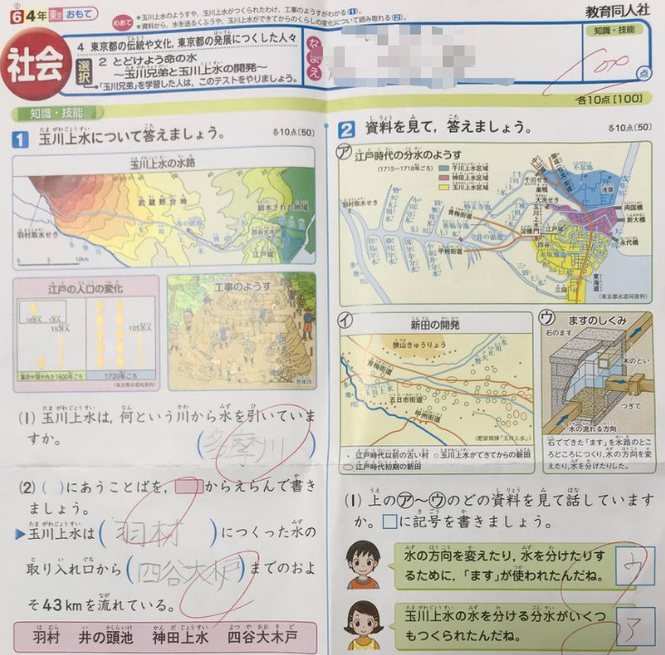

# 海外学童的中文教育

## 除了学中文之外还需要学什么呢？

不经意间看到了女儿的考卷。

里面的内容对我也是新鲜的，但看内容以前我看到了考卷的印刷质量还有图解的精致度实在远非30多年前可以比较的。

这一代人的学习也受到科技的影响。感觉好像容易多了，容易理解多了。

不过看了考卷上的内容，里面写的不是我收悉的山川河流的名称，突然间有一个念头冒出来，孩子们需不需要学地理历史呢？

为了跟家族亲戚沟通，中文肯定是一直学习的，但地理历史，估计很少人留意过了。

孩子他们第一个跳出来反对。不过这我也不惊讶，每次给他们加作业他们都反对。这是反射动作由小脑控制的。

心里还是有点惆怅，突然间的民族认同感涌上心头。

## home schooling

前几天听到一个访谈，主要在说小学教育和耳濡目染的。

大部分的教育都是在培养以后在这个社会能够顺应生存的。在日本很难不联想到长大后可以在企业里上班而需要的合作，沟通，汇报，具有这种基本素质的教育。

但在美国，好像home schooling也很根深蒂固。这也意味这有些知识学校虽然没有教，但家长还是要有意识的教给孩子。

该访谈的作者说他爸爸以前是修理摩托车的，因此他从小就很习惯这种开小店，经营管理的这种财商。也就是说即使不上班也不会很奇怪，做做生意也是个好选项。

相对我这个从毕业后几乎没有一天不属于哪一家公司，也就是一直有组织的人来说，这的确是很开启我。对于商业其实完全不了解，让我脱离组织去创业那真的很不安。

扯远了。 老实说我也在考虑home schooling教孩子们历史地理，甚至唐诗三百首。

## 落地生根

犹豫是否要做的同时，想起了不久前听新加波总理演讲的纲要。我们华人，不要一直像落叶归根，而要想落地生根。

李总理的中文和英文都很好。就好像同胞一样，但人家可是道道地地的外国人。

新加波也都是华人呢。

是呀，我们这一代有些东西肯定是传不到下一代的。

还是不要妨碍他们落地生根好了。历史地理这些，只要有中文的基础，只要有兴趣看几集CCTV科教频道，就可以拿的起来的。

 

