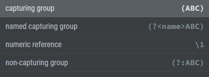
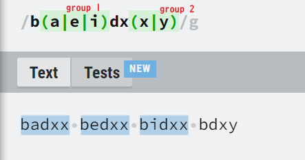
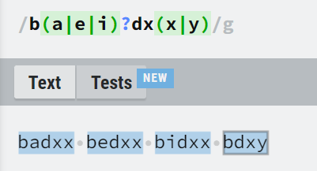
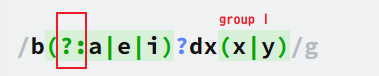
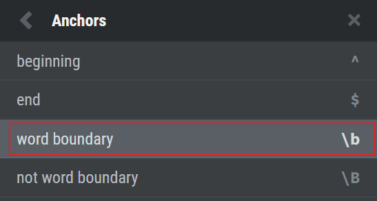
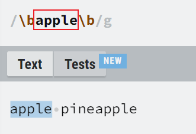
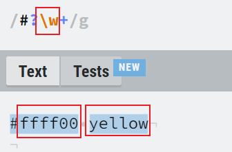
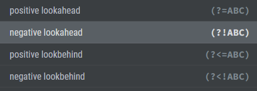
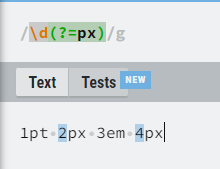

# 开发人员经常使用的正则表达式

## 正则表达式并不是一个很新的东西，它是在1940年就已经出现了所以已经非常完备而且被广泛支持。

  <svg viewBox="0 0 200 100">
    <circle cx="100" cy="50" r="40" stroke="white" stroke-width="5" fill="yellow"/>
  </svg>

# 所见即所得的网站：regexr.com

学习的资料实在是太多，在这里就不多做介绍。除了文本编辑器，Javascript等程序语言之外，上面的网站[RegExr: Learn, Build, & Test RegEx](https://regexr.com/)也可以提供很好的演练和学习正则表达式的环境。

# 几个工作Tips分享

主要想要分享最近在工作上使用，几个比较特别，比较少用，但非常实用的用法，希望阅读这篇文章之后可以给你们带来一点点工作上的帮助。

## 括号的活用

分组group在正则表达式里面是经常使用的，它使用括号来表示。挂号搭配其他用法的时候，可以变化出各种不同的组合。

以下面的例子是使用了or来搭配扩号。

简单的意思是第一组是a,e,i，第二组可能的值是x,y。

## 善用Optional

但如果我们想要把bdxy也包括进来，那一种可能性就是把上述的表达式改成：

多了一个问号“？”，这个问号就是代表可有可无，optional，如此一来bdxy这个在b和d之间没有任何字母的也可以被一起包括进来了。

## 避开分组

但如此一来会遇到新的问题，那就是原来的
- 第一组：a,e,i
- 第二组：x,y

会变成
- 第一组：a,e,i或没有
- 第二组：x,y 或 第一组:x,y

因为在第一组的文字取得不到的时候，第一组就不再存在。这个时候原本的第二组会变成第一组。

有没有可能避开那个有可能会消失的第一组呢？ 因为写程序的时候原本打算要取第二组的值，要是突然变成第一组，那可是要改代码的。

还好这个问题前辈已经帮我们考虑过了，我们可以利用下面的方法，将不确定的因素不划入分组。

也就是加上?:，就可以把第一个括号，不纳入分组了。

用法很多。比方说下面三种组合：
- a="b"
- a='b'
- a=b

如果只想改变上面的b的值为c，那么这里介绍的方法，会很好用。

## 巧用边界设定

这个小技巧可以避开很多bug。 举个例子，比方说你想要替换的apple，是真正的apple而不是凤梨Pineapple,如果只写apple那肯定会造成不少问题。但加上边界的话，就很清晰了。

## 区分文字与符号的好方法

键盘上有很多字母，但大体上可以分为两类，文字和符号。在进行表达式的时候当然可以穷举出所有的文字或符号，但这会影响可读性。如果使用\w来代替所有的文字，那就很方便。

比方说我们使用下面的例子来捕捉style sheet里面的颜色：

# 进阶用法
顺便介绍一下自己也搞不太清楚的，感觉很进阶的用法，期待将来在工作中有机会将他们弄懂
## lookaround

共分为4种，往前看往后看，positive 和 negative

主要用来找出一段文字但不包含指定文字。

比方说下列的几个文字
### 1pt 2px 3em 4px
如果只想要取得后面跟着px的数字，可以使用以下的写法
#### \d(?=px)

# 结论

最近在做一个以替换为主的项目，大部分的时间都是在写刁钻的正则表达式。借由这篇文章分享一写些许的心得。

 

