#  Promise与Async/Await（JS）

## 今天的主题是分享JavaScript里面的几个特别的用法。下面这几个单字都是跟JavaScript有关的，肯定有很多人不曾听过吧

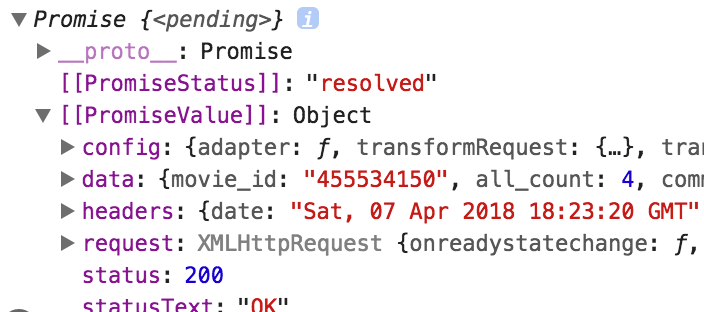

# Javascript的同步处理与非同步处理

最近因为在做项目的时候遇到了一个很难的需求，就是要取代浏览器里面的alert和confirm。因为原生的这两个套件长的太丑了，而且也没有提供接口可以让码农们对它进行调整。先上图。
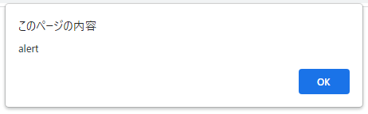

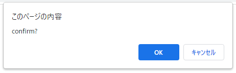

但不要小看这两个不起眼的画面，它提供了一个特殊的功能，像一个红绿灯一样，让所有正在处理中的工作停留在原地，等待使用者按下一个按钮。如果不使用者两个特别的功能，要自己实装出同样的东西，那可是大工程了，并且一定会遇到同步的问题。先上一个美美的绣花枕头，也就是改造后的画面：

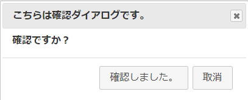

## 什么是同步

同步问题听中文不容易理解，遇到不能理解的事情没有什么不能用代码解决的，啊说错了，是流程图，先看看下方流程图。

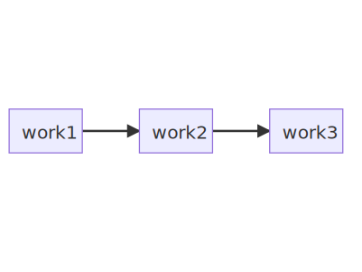

 
井然有序是很重要的，如果有人插队的话那逻辑就会混乱的！这个就叫做同步处理。即使上述的work2很花时间，还是会等待work2结束后，才进行work3.就好象是一定要先煮饭好才能吃饭一样的天经地义。

## 什么是异步
但在Javascript的时间里事情经常不是如此。如果上图的work2是需要“被等待”的话，即使只需要等待1毫秒，就会马上被归类为异步处理，事情通常会变成这样。

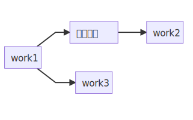

这个时候就会变成work3先被优先执行，让work2在旁边慢慢执行了。也就是不等饭煮好就先去外面吃了，让饭在家里慢慢煮。

这样的设计的优点就是遇到真的很花时间的处理，也不会让使用者焦急等待，可以先去做其他的工作。但在需要确保流程正确的处理下，这就会出现问题。

要如何确保让work2完成前，不执行work3，这就要用到关键字来指定了。

##  Promise与Async/Await
这3个单字，分别是承诺，同步，等待。他们之间的关系比较难说清楚，先来看代码：

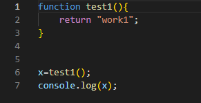

上面代码执行结果是

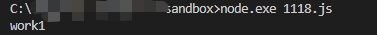

接下来我们加个关键字，async到程序里：

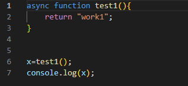

这时候的输出是

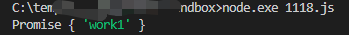

这里我们看到了Promise了！这里揭示了一个法则，就是将所有的function加上**async**的关键字后，它的返回值都会变成Promise：
- 如果原先返回了一个1，它返回Promise
- 如果原先返回True，它还是返回Promise

这就造成了一个问题，原本后续处理可能是跟着if判断的，但变成了Promise后，就无法进行原来的判断了，因为它在也无法返回布林值。同理以此类推。
## 下面这两个函数其实是同样的意思

我们知道了Promise如何产生后，也能够理解这两个函数其实是同样一回事了。

## 如何取回返回值？

async函数所说的承诺（Promise），都要经过等待（await），才能取回原来的值。
在看一下下面的代码：

## Promise是什么

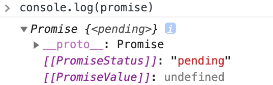

Promise具有状态、叫做PromiseStatus，包含了下面三种情况。

- pending: 等待处理结束
- resolved: 处理结束并且没有出现错误，接着Then处理
- rejected: 处理结束但没有成功，接着Catch处理
- 
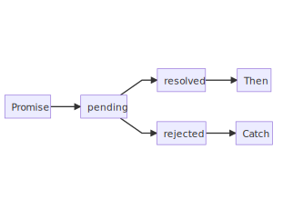

想要把异步处理和同步处理相结合，着实不容易。除非在系统设计时候进行考虑，或是使用成熟框架之外，就只能够追着函数不停的加async，然后在返回值的地方加await。
## 结论

估计还可以在写几千字，但还是打算就此打住，当作概念介绍，有真正遇到课题的朋友，可以到网上查看更多资料。

