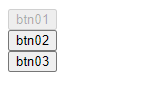

# JavaScript的小技巧分享

## 使用開發者工具 Developer Tools的小秘訣

# 場景
當打開一個頁面後發現有個按鈕無效了，該客戶感到非常的困擾，詢問為何會無效。
為了說明起見，下面的內容使用一個很簡單的網頁。

# 解決方法

按鈕變得無效有可能是有條件判斷，在或許是因為條件沒有滿足才變得無效，或是一開始預設無效。
當然這個時候最好的方法就是看看有沒有什麼程序在試圖更改這個按鈕的屬性。

有沒有這麼好用的工具呢？答案是有的，下面為您揭曉。

## 使用工具來設定中斷點

打開瀏覽器自帶的開發者工具Ctrl + Shift + I，裡面有很多按鈕，先選中我們想要監視的。然後選擇屬性來設定中斷點，因為按鈕的有效與否是它的屬性，目標就是捕捉在什麼時候這個屬性被修改的。

接下來就要重新載入畫面。但是有時候並沒有辦法簡單的載入頁面（受到其他JS的影響），這個時候我們可以直接對開發者工具下命令，讓其幫忙Reload該畫面。

`window.location.reload()`

## 重新載入頁面之後

發現沒有任何的異常舉動，之前所設定的中斷點，並沒有發生效果，也就是說沒有辦法捕捉到在什麼節點，這個按鈕被無效化了。

### 經過考察原因後

>  In Chrome, DOM breakpoints are not preserved upon refresh, they are thrown away, and then restored after the onload event

很明確的寫著，在Reload完成之前，設定好的中斷點都會先被放在一邊，因此沒有效果。

## 改變作戰方案

既然不能靠著Reload畫面來達到效果，之好使用別的方法了，山不轉路轉。
打開程序碼菜單，然後找個可能是有效的地方，設定中斷點，這次是針對程序而言的。

設定好後會出現一個箭頭。

右邊的菜單也可以看到我們剛剛設定好的中斷點。

再度Reload後，發現這次有效了。

但這個中斷點不是目的地，這時候按下F8，看看能否停止下個斷點。

這次成功的捕捉到將這個按鈕無效化的位置了。

## 細節

上面的畫面包含很多細節，可以做很多進一步的調查。
接下來就可以根據實際情況回答客戶可能的各種提問了。

